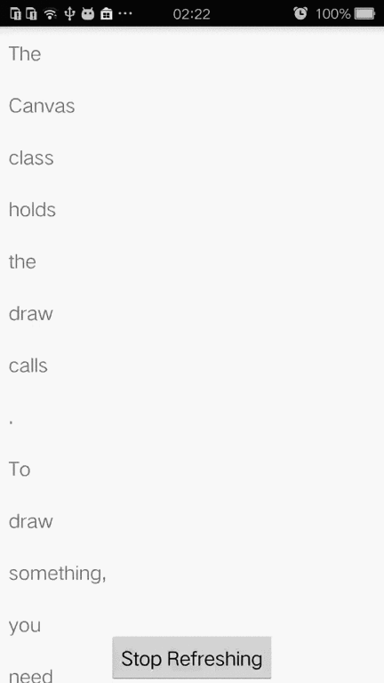

This is a project with custom pull-to-refresh layout which contains a interesting animation. And the animation is inspired by <https://dribbble.com/shots/1797373-Pull-Down-To-Refresh> made by Ramotion.  

###Demo###


  


###Usage###


``` xml
<com.tuesda.walker.circlerefresh.CircleRefreshLayout
        xmlns:app="http://schemas.android.com/apk/res-auto"
        app:AniBackColor="#ff8b90af"
        app:AniForeColor="#ffffffff"
        app:CircleSmaller="6"
        android:id="@+id/refresh_layout"
        android:layout_width="match_parent"
        android:layout_height="match_parent">
        <ListView
            android:background="#ffffffff"
            android:id="@+id/list"
            android:layout_width="match_parent"
            android:layout_height="match_parent"></ListView>
    </com.tuesda.walker.circlerefresh.CircleRefreshLayout>
```  

Call back when refresh starts and complete:  

``` java
mRefreshLayout.setOnRefreshListener(
                new CircleRefreshLayout.OnCircleRefreshListener() {
            @Override
            public void refreshing() {
                // do something when refresh starts
            }

            @Override
            public void completeRefresh() {
                // do something when refresh complete
            }
        });
```

when refreshing is done(for example, the image loading completes), you can invoke:  

``` java
mRefreshLayout.finishRefreshing();
```

###License###
MIT
